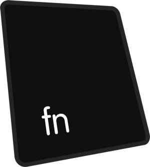
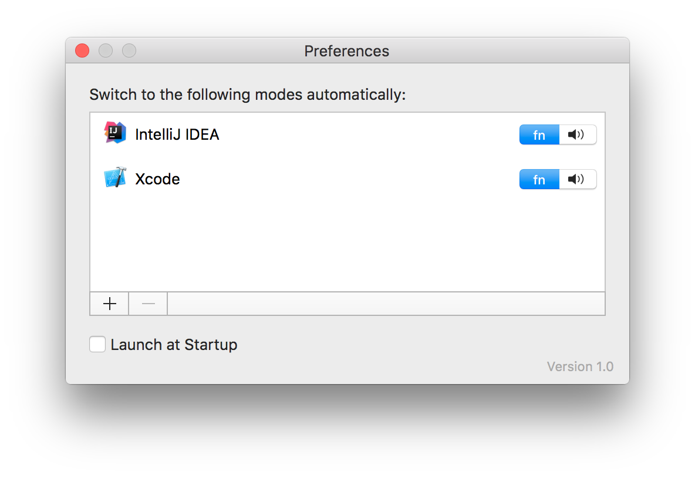

# fn

A puristic menu bar application for OS X that toggles the "fn" state of the F-Keys on Apple keyboards based on the active application.

The application relies on IOKit to change the fn button state and therefore does not run within the App-Store sandbox, which is why I made it Open Source.

## Download / Compile / Run

Open the project in XCode and compile it yourself or [download](https://github.com/flqw/fn/releases/download/v1.0.0/fn.app.zip) the release zip that contains the application signed with my developer identity.

## Usage

Start the application. ``Click`` the menu bar icon to toggle the current state manually. ``Option + Click`` the menu bar icon to access the context menu and preferences. Any running application can be added and configured from the preferences window.

## Contribute

Any contribution in form of issues or pull requests is welcome.
